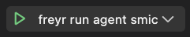

# Install Freyr develop enviroments

This document will be to install freyr project develop enviroment with you.

**Please notes: The software version limitations used in this document are as follows**

1. Visual Studio Code 1.76
   
2. Golang 1.19

## Download & Install Visual Studio Code

1. [Download Visual Studio Code 1.76](https://code.visualstudio.com/updates/v1_76) for your compute machine

2. Please refer to visual studio code official [install tutorial](https://code.visualstudio.com/docs/setup/linux) on your compute machine to install it.
   
3. launch linux terminal application and execute `code` command.

## Download & Install Golang 

1. Please refrence Golang official [install tutorial](https://golang.google.cn/doc/install) for your compute machine
   - version must go1.19
    
2. To speed up download dependencies we will configure `GOPROXY`  
   ```shell
    go env -w GOPROXY="https://goproxy.cn,direct"
   ```

## Open & Run freyr project by `Visual Studio Code`

1. Go to the Freyr project directory on your local machine
   
2. Execute command `code .` will be open freyr project by `Visual Studio Code`

3. Open `Run and Debug` tab and click `create a launch.json file`

4. Add below code block to `launch.json`
    ```json
    {
        // Use IntelliSense to learn about possible attributes.
        // Hover to view descriptions of existing attributes.
        // For more information, visit: https://go.microsoft.com/fwlink/?linkid=830387
        "version": "0.2.0",
        "configurations": [
            {
                "name": "freyr run agent smic",
                "type": "go",
                "request": "launch",
                "mode": "auto",
                "program": "${workspaceFolder}/cmd/freyr",
                "args": [
                    "agent",
                    "smic"
                ],
                "env": {
                    
                }
            },
        ]
    }
    ```
4. Congratulations! Your have finished all install step.

## Run freyr

- Open `Run and Debug` tab and click `Start Debugging(F5)`

  