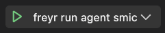

# 安装Freyr开发环境

本文将指导您安装Freyr项目的开发环境。

**请注意，本文使用的软件版本限制如下**

1. Visual Studio Code 1.76

2. Golang 1.19

## 下载和安装Visual Studio Code

1. 从 [Visual Studio Code 1.76](https://code.visualstudio.com/updates/v1_76) 下载安装到您的计算机上。

2. 请参考 [Visual Studio Code 官方安装教程](https://code.visualstudio.com/docs/setup/linux) 在您的计算机上安装它。

3. 打开Linux终端应用程序并执行 `code` 命令。

## 下载和安装Golang

1. 请参考 [Golang 官方安装教程](https://golang.google.cn/doc/install) 在您的计算机上安装。
   - 版本必须是 go1.19。

2. 为了加快下载依赖包的速度，我们将配置 `GOPROXY`。

   ```shell
    
    go env -w GOPROXY="https://goproxy.cn,direct"

   ```

## 用 `Visual Studio Code` 打开并运行 Freyr 项目

1. 进入本地机器上的 Freyr 项目目录。

2. 执行 `code .` 命令将用 `Visual Studio Code` 打开 Freyr 项目。

3. 打开 `Run and Debug` 选项卡并单击 `create a launch.json file`。

4. 在 `launch.json` 中添加以下代码块：

   ```json
    {
        // Use IntelliSense to learn about possible attributes.
        // Hover to view descriptions of existing attributes.
        // For more information, visit: https://go.microsoft.com/fwlink/?linkid=830387
        "version": "0.2.0",
        "configurations": [
            {
                "name": "freyr run agent smic",
                "type": "go",
                "request": "launch",
                "mode": "auto",
                "program": "${workspaceFolder}/cmd/freyr",
                "args": [
                    "agent",
                    "smic"
                ],
                "env": {
                    
                }
            },
        ]
    }
    ```

5. 恭喜！您已完成所有安装步骤。

## 运行Freyr

- 打开 `Run and Debug` 选项卡并单击 `Start Debugging(F5)`。

  
